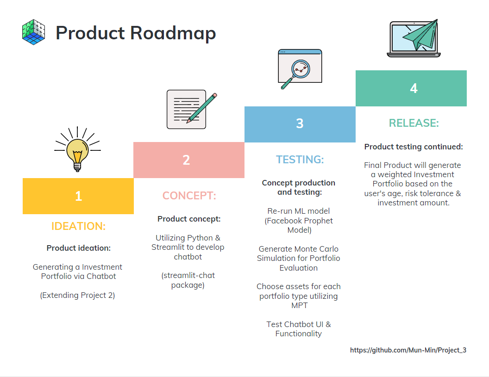

# Developing an Investment Portfolio via Chatbot

## Run the Chatbot using Streamlit Cloud

Link to Chatbot --> https://investachat.streamlit.app/

## Running the Chatbot Locally 
You must download the following packages in order to run the Chatbot:

    <b>Python (version 3.9.12):</b>

    pip install python==3.9.12

    <b>Streamlit-Chat Package (version 0.0.2.1):</b>

    pip install streamlit-chat
    from streamlit_chat import message

    <b>Streamlit Package (version 1.15.2):</b>

    pip install streamlit
    conda install -c conda-forge streamlit
    import streamlit as st

    <b>Plotly Package (version 5.9.0):</b>

    pip install plotly
    conda install -c plotly plotly
    import plotly.express as px
    import plotly.graph_objects as go

  

